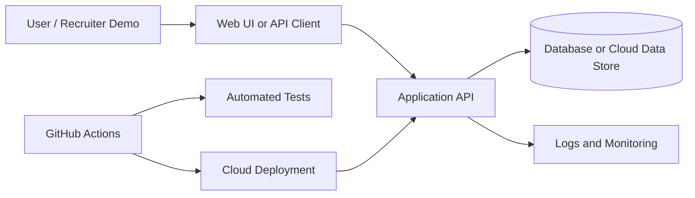

# CloudDesk Helpdesk

## Level

Capstone project

## Problem It Solves

Small businesses need a simple support ticket system without enterprise complexity, but with enough structure to track issues, comments, priority, status, and service quality.

## Target Roles

Software Developer, Backend Developer, Full Stack Developer, Cloud Engineer, DevOps Engineer

## Tech Stack

Next.js, Node.js, PostgreSQL, Prisma, Docker, GitHub Actions, Terraform, AWS/Azure/GCP

## Key Features

- User and admin roles
- Ticket creation and assignment
- Comments and file attachment model
- Ticket status and priority workflows
- Notification design
- Analytics dashboard
- Docker, CI, IaC, and cloud deployment plan

## System Architecture



## Folder Structure

```text
.
|-- README.md
|-- LICENSE
|-- CONTRIBUTING.md
|-- .env.example
|-- .gitignore
|-- .github/
|   |-- workflows/
|   |-- PULL_REQUEST_TEMPLATE.md
|   |-- ISSUES.md
|   |-- MILESTONES.md
|   |-- LABELS.md
|-- docs/
|   |-- API.md
|   |-- ARCHITECTURE.md
|   |-- DEPLOYMENT.md
|   |-- SECURITY.md
|-- screenshots/
|-- src/
|-- test/
```

## Database Schema

```text
users(id, email, name, role, created_at)
tickets(id, requester_id, assigned_to_id, subject, description, status, priority, created_at, updated_at)
comments(id, ticket_id, author_id, body, created_at)
attachments(id, ticket_id, file_name, storage_key, content_type, created_at)
notifications(id, user_id, type, payload_json, read_at, created_at)
audit_logs(id, actor_id, action, entity_type, entity_id, created_at)
```

## API Endpoints

- `POST /api/tickets`
- `GET /api/tickets`
- `GET /api/tickets/:id`
- `PATCH /api/tickets/:id/status`
- `POST /api/tickets/:id/comments`
- `POST /api/tickets/:id/attachments`
- `GET /api/admin/analytics`

## Cloud Deployment Plan

Deploy app to Vercel/Render/Azure App Service. Use managed PostgreSQL. Store files in S3/Azure Blob/GCS. Provision cloud resources with Terraform.

## CI/CD Pipeline

GitHub Actions runs lint, type checks, tests, build, Docker build, and Terraform validation.

## Testing Strategy

Unit test status transition rules, API validation, RBAC guards, and analytics calculations. Add Playwright tests for ticket creation and admin triage.

## Security Considerations

Enforce RBAC, validate file uploads, restrict attachment types, protect ticket ownership, store secrets securely, and audit sensitive actions.

## Local Setup

```bash
cp .env.example .env
npm install
npm test
npm run dev
```

## Screenshots

Add screenshots to the `screenshots/` folder:

- Dashboard or landing screen
- API documentation
- Test output
- Deployment page

## Demo Credentials

Use only local/demo credentials. Do not commit real accounts.

```text
Email: demo@example.com
Password: DemoPassword123!
```

## Resume Bullet Points

- Designed a cloud-native helpdesk capstone with ticket workflows, role-based access, comments, file attachment architecture, analytics, Docker, CI/CD, and Terraform deployment planning.
- Modelled production concerns including RBAC, audit logs, managed database deployment, object storage, testing, and monitoring.

## LinkedIn Post Caption

I started CloudDesk Helpdesk as my capstone portfolio project: a cloud-ready ticketing system with roles, tickets, comments, attachments, analytics, Docker, CI/CD, and infrastructure planning.

## Portfolio Description

A cloud-native helpdesk capstone showing full-stack engineering, backend workflows, database modelling, DevOps automation, security, and cloud deployment readiness.

## Commit Plan

1. `chore: scaffold repository structure`
2. `docs: add architecture and deployment plan`
3. `feat: add core data models`
4. `feat: implement primary workflow`
5. `test: add validation and service tests`
6. `ci: add GitHub Actions workflow`
7. `docs: add screenshots and demo instructions`
