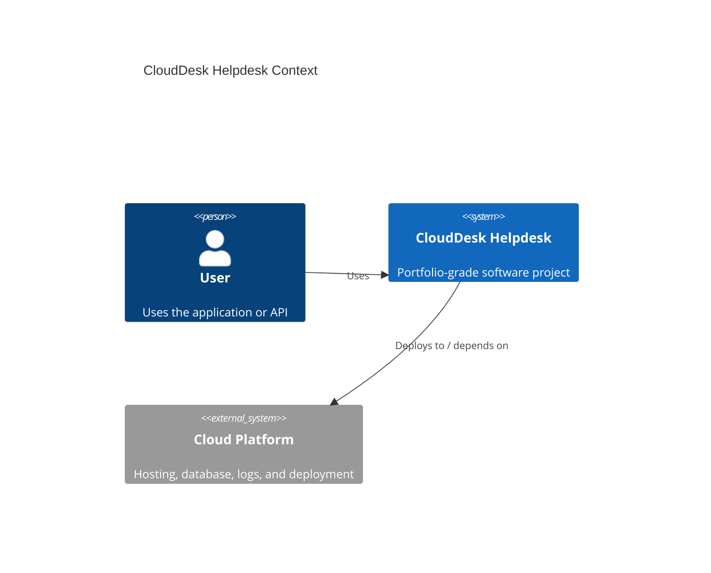

# Architecture

## Problem

Small businesses need a simple support ticket system without enterprise complexity, but with enough structure to track issues, comments, priority, status, and service quality.

## System Context

## Main Components

- UI or API layer
- Application service layer
- Data access layer
- Database or cloud data store
- CI/CD pipeline
- Deployment and monitoring

## Engineering Tradeoffs

- Keep the first version small enough to finish.
- Document future production improvements separately.
- Prefer boring, understandable architecture over unnecessary complexity.
