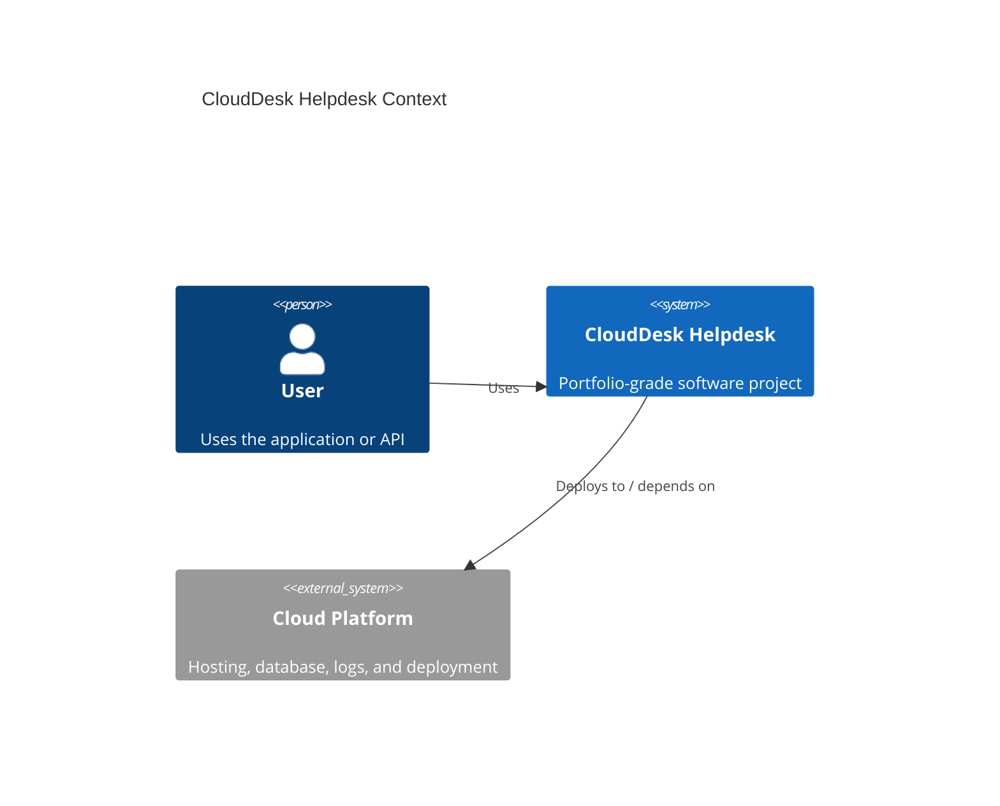

# Architecture

## Problem

Small businesses need a simple support ticket system without enterprise complexity, but with enough structure to track issues, comments, priority, status, and service quality.

## System Context

## Main Components

- Web/API layer for ticket creation, triage, comments, attachments, and admin analytics.
- Ticket workflow module for status transitions, priority rules, ownership visibility, and analytics.
- PostgreSQL data model for users, tickets, comments, attachments, notifications, and audit logs.
- Object storage model for attachments using S3, Azure Blob, or GCS.
- Docker and GitHub Actions plan for repeatable build, test, and release checks.
- Terraform plan for cloud resources and environment-specific deployment.

## Engineering Tradeoffs

- Model ticket workflow rules before adding UI polish so the core business process stays clear.
- Keep attachments as storage references instead of database blobs.
- Include audit logs early because support systems often need accountability.
- Keep cloud deployment documented even while the MVP remains locally runnable.

## Next Production Improvements

- Add persistent PostgreSQL migrations and seed data.
- Add Playwright tests for ticket creation, assignment, and admin triage.
- Add notification delivery through email or queue-backed workers.
- Add monitoring for ticket backlog, SLA risk, and attachment failures.
